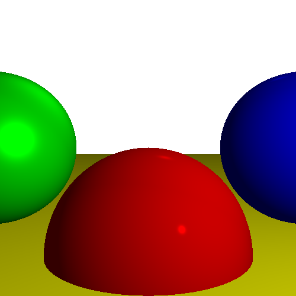

# Assignment 2 - Ray Tracing with Lighting

## Task Overview
In this assignment, we extend the **Ray Tracer** from Assignment 1 by introducing **lighting effects** to create a more realistic rendered scene. The rendering now includes three types of light sources and incorporates both **specular** and **diffuse** lighting components.

### Key Enhancements:
- **Ambient Light:** Provides a base level of lighting across the entire scene.
- **Point Light:** A light source that emits light in all directions from a specific point.
- **Directional Light:** A light source that emits parallel rays from a specific direction.
- **Diffuse Lighting:** Simulates light scattering for a more natural appearance.
- **Specular Lighting:** Adds highlights for shinier surfaces.

By implementing these lighting models, the scene now appears more visually dynamic and three-dimensional.

---

## Output
Below is the rendered image generated by the ray tracer with applied lighting effects:



The addition of lighting creates a more realistic shading effect on the spheres, making them appear illuminated based on the position of the light sources.

---

## Running the Code
Ensure that Python is installed and navigate to the `assignment2` directory. Then, run:

```bash
python3 main.py
```

This will generate the output image as `assignment_2_output.png` in the same directory.

---

### Additional Notes
- The implementation expands upon the basic ray tracing concepts introduced in Assignment 1.
- Light positioning and intensity influence the final rendered image.
- Further enhancements, such as shadows and reflections, can be explored in future assignments.
