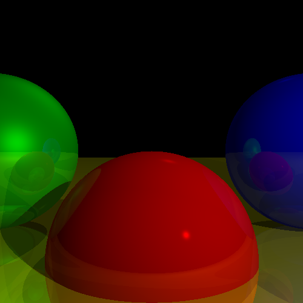

# Assignment 3 - Ray Tracing with Shadows and Reflections

## Task Overview
In this assignment, we enhance the **Ray Tracer** from Assignment 2 by introducing **shadows** and **reflections**, making the rendered scene even more realistic. These additions simulate how light interacts with objects, adding depth and realism to the image.

### Key Enhancements:
- **Shadows:** Objects now cast shadows when they block light sources.
- **Reflections:** Surfaces can reflect light, allowing objects to mirror their surroundings.
- **Improved Lighting Model:** Shadows and reflections interact with existing **ambient**, **point**, and **directional** light sources.

By implementing these features, we achieve a more physically accurate and visually appealing rendered scene.

---

## Output
Below is the rendered image generated by the ray tracer with applied shadows and reflections:



The shadows add a sense of depth, while reflections create a more polished and realistic look for the spheres.

---

## Running the Code
Ensure that Python is installed and navigate to the `assignment3` directory. Then, run:

```bash
python3 main.py
```

This will generate the output image as `assignment_3_output.png` in the same directory.

---

### Additional Notes
- Shadows are calculated by checking if a point is occluded from a light source.
- Reflections are determined using **recursive ray tracing**, allowing objects to reflect their surroundings.
