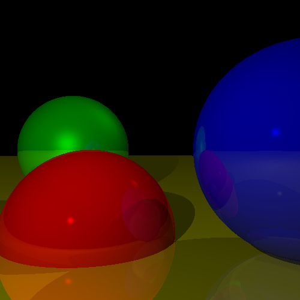

# Assignment 4 - Ray Tracing with Camera Rotation

## Task Overview
In this assignment, we extend the **Ray Tracer** from Assignment 3 by introducing **camera rotation**, allowing us to change the viewpoint and observe the scene from different angles. This enhancement provides a more dynamic perspective and better visualization of the rendered objects.

### Key Enhancements:
- **Camera Rotation:** Adjust the camera's orientation to look around the scene.
- **View Transformation:** Compute new ray directions based on the rotated camera.
- **Maintained Lighting, Shadows, and Reflections:** The previous features still apply, but now they can be seen from different perspectives.

This feature significantly improves scene composition and realism by allowing different viewing angles.

---

## Output
Below is the rendered image generated by the ray tracer with applied camera rotation:



The ability to rotate the camera gives a new depth to the scene, allowing for better visualization of reflections, shadows, and lighting interactions.

---

## Running the Code
Ensure that Python is installed and navigate to the `assignment4` directory. Then, run:

```bash
python3 main.py
```

This will generate the output image as `assignment_4_output.png` in the same directory.

---

### Additional Notes
- The camera rotation is implemented using **transformation matrices** to adjust the viewing direction.
- Ray directions are recalculated based on the camera's new orientation.
