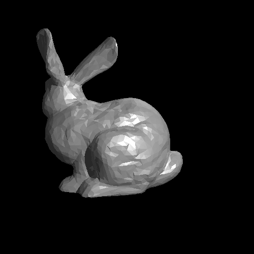

# Assignment 5 - Ray Tracing Triangles & BVH Optimization

## Task Overview
In this assignment, we extend our **Ray Tracer** by introducing support for **triangles** and rendering the **Stanford Bunny** using data stored in the `bunny.obj` file.** To optimize rendering performance, we implement a **Bounding Volume Hierarchy (BVH)** to accelerate ray-object intersection calculations.

### Key Enhancements:
- **Triangle Ray Tracing:** Extend the ray tracer to support triangle mesh rendering.
- **Stanford Bunny Rendering:** Load and parse the `bunny.obj` file to visualize a detailed 3D model.
- **BVH Acceleration Structure:** Implement a BVH tree to efficiently accelerate ray-triangle intersections and improve rendering performance.
- **Optimized Scene Rendering:** Reduces computation time by efficiently culling unnecessary intersection tests.

This enhancement allows us to render more complex and realistic 3D objects in an optimized manner.

---

## Output
Below is the rendered image generated by the ray tracer, featuring the **Stanford Bunny**:



By utilizing **BVH optimization**, rendering efficiency is significantly improved, making it feasible to handle complex 3D models like the Stanford Bunny.

---

## Running the Code
Ensure that Python is installed and navigate to the `assignment5` directory. Then, run:

```bash
python3 main.py
```

This will generate the output image as `bunny.png` in the same directory.

---

### Additional Notes
- The **bunny.obj** file contains the vertex and face data for the Stanford Bunny model.
- The **BVH Tree** speeds up rendering by reducing the number of intersection tests required.