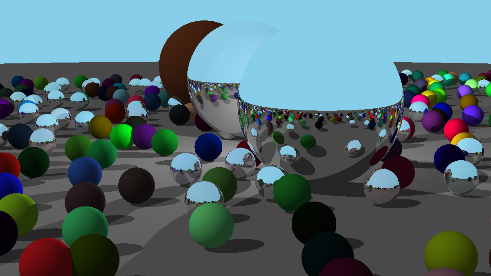

# Project 1 - Ray Tracing with Material Properties

## Task Overview
This project builds upon previous ray tracing assignments by rendering a scene with multiple spheres, each with distinct material properties. The scene consists of:
- **Three Large Spheres in the Center:**
  - **Metallic Sphere:** Reflects light with a glossy effect.
  - **Glass Sphere:** Demonstrates light refraction.
  - **Lambertian Sphere:** A matte surface with diffuse reflection.
- **Randomly Placed Spheres:** Populating the surrounding area to create a rich, complex scene.

### Key Features:
- **Material Rendering:** Different shading models for metal, glass, and diffuse materials.
- **Reflection and Refraction:** Accurate light interactions with the metallic and glass spheres.
- **Random Scene Generation:** A variety of smaller spheres scattered around the scene for depth and complexity.
- **Lighting and Shadows:** Enhances realism with proper shading and light interactions.

---

## Output
Below is the rendered image showcasing the scene:



This output demonstrates realistic **metallic reflections, glass refractions, and diffuse shading** within a dynamic scene.

---

## Running the Code
Ensure Python is installed and navigate to the `project1` directory. Then, run:

```bash
python3 main.py
```

This will generate the output image as `project_output.png` in the same directory.

---

